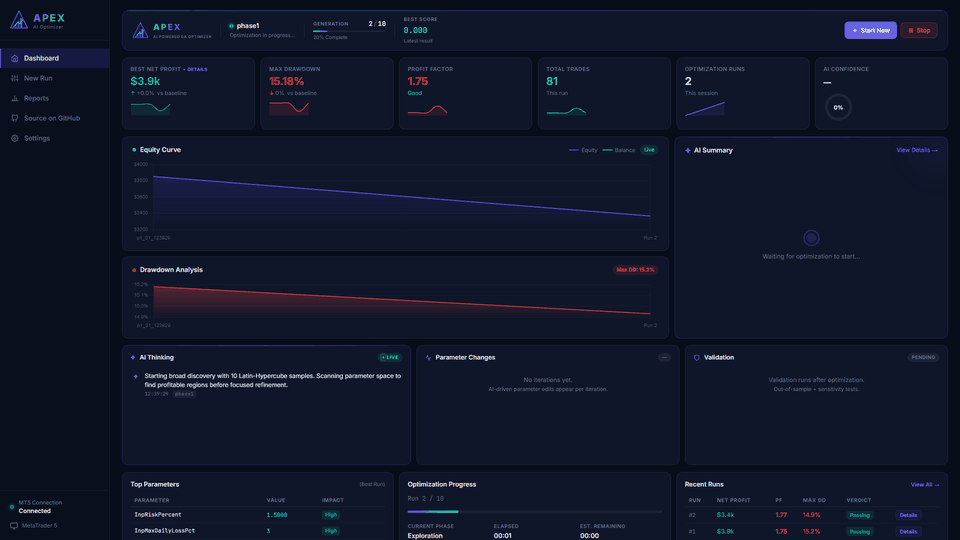

# APEX — AI‑Powered MT5 EA Optimizer

[](https://www.anthropic.com/news/claude-opus-4-7) [](LICENSE) [](demo/run_demo.py)

> **An AI trader thinking out loud while it tests, fails, and improves a strategy.**

> Built with **[Claude Opus 4.7](https://www.anthropic.com/news/claude-opus-4-7)** for the [Cerebral Valley × Anthropic — Built with Opus 4.7 hackathon](https://cerebralvalley.ai/e/built-with-4-7-hackathon).

APEX is an autonomous optimizer for MetaTrader 5 Expert Advisors. Instead of brute‑forcing
parameters with grid search, an LLM reads each backtest result, decides which parameter to
change and why, then runs the next backtest — iterating toward profit‑factor / drawdown /
Calmar targets you set. Every reasoning step streams live to a dashboard.

---

## Why this is different

| Traditional optimizers | APEX |
| --- | --- |
| Brute‑force grid / genetic search | AI reads each result, **decides** what to change |
| Black box — see only final winner | Live **thinking feed** + per‑iteration param diffs |
| No notion of *why* a config works | Stores AI analysis next to every run |
| Stops after N iterations | Stops when **quality targets are met** (early exit) |
| One‑shot validation | Out‑of‑sample **+ sensitivity** with live progress |

---

## Demo



> *6‑frame timelapse of one autonomous run — Phase 1 exploration → Phase 2 AI iteration → Phase 3 validation → verdict. Every backtest, every parameter change, and every line of AI reasoning streams live.*

A static high‑res view is at [`screenshots/dashboard.png`](screenshots/dashboard.png). The dashboard shows three live phases — **Exploration → Iteration → Validation** — with the AI's reasoning streaming on the right, parameter changes per iteration in the centre, and an out‑of‑sample/sensitivity validation panel that updates as MT5 finishes each test.

Other views: [setup wizard](screenshots/setup.png) · [settings modal](screenshots/settings_modal.png) · [best‑result modal with evolution path](screenshots/best_result_modal.png)

---

## How it works

```
┌──────────────────────────────────────────────────────────────────────────┐
│                       APEX OPTIMIZATION LOOP                             │
│                                                                          │
│   Phase 1: EXPLORATION                                                   │
│     Latin‑Hypercube sample N parameter sets → run in MT5 Strategy Tester │
│     → score with Calmar / PF / MFE / session‑stability / recovery        │
│                                                                          │
│   Phase 2: AI ITERATION (autonomous loop)                                │
│     ┌──► Claude reads full history + targets + parameter schema          │
│     │      ↓                                                             │
│     │    Claude returns: { changes:[{param,value,reason}], confidence }  │
│     │      ↓                                                             │
│     │    Apply changes (clamped to schema bounds), dedupe, run backtest  │
│     │      ↓                                                             │
│     │    Stream `ai_thinking` + `param_changes` events to UI             │
│     │      ↓                                                             │
│     └──── Targets met? → exit early.  Stuck? → random escape.            │
│                                                                          │
│   Phase 3: VALIDATION                                                    │
│     Out‑of‑sample run on unseen dates + ±20% sensitivity probe on the    │
│     top parameter → verdict: RECOMMENDED / RISKY / NOT_RELIABLE          │
│                                                                          │
│   Output: ranked .set file + per‑run report folder + final verdict       │
└──────────────────────────────────────────────────────────────────────────┘
```

The AI loop lives in [`optimizer/ai_guided_loop.py`](optimizer/ai_guided_loop.py); the
reasoner contract is in [`analysis/ai_reasoner.py`](analysis/ai_reasoner.py); event emission
to the UI flows through [`optimizer/pipeline.py`](optimizer/pipeline.py) via SocketIO.

---

## Quick start

### 1. Clone + install

```bash
git clone https://github.com/tonnylegacy/MT5_Optimizer.git
cd MT5_Optimizer
python -m venv .venv
.venv\Scripts\activate            # Windows
# source .venv/bin/activate       # macOS/Linux
pip install -r requirements.txt
```

### 2. Configure

Copy the example config and fill it in:

```bash
cp config.example.yaml config.yaml
```

Set your Anthropic API key (get one at <https://console.anthropic.com/>):

```bash
# Option A — environment variable (recommended)
setx ANTHROPIC_API_KEY "sk-ant-..."     # Windows
export ANTHROPIC_API_KEY="sk-ant-..."   # macOS/Linux

# Option B — paste into config.yaml under ai.anthropic_api_key
```

Edit `config.yaml` to match your local MT5 install paths under `mt5:` (terminal exe,
AppData path, MQL5 Files path).

### 3. Launch

```bash
python app.py
```

Open <http://localhost:5000>. Register your EA on the **Setup** page, set thresholds,
hit **Start**, and watch the AI think.

### Demo mode (no MT5 required)

Don't have MT5 installed? The offline demo feeds synthetic backtest results
through the same AI loop and dashboard. **It auto-starts** — open the link
the script prints, sit back, and watch APEX think:

```bash
python -m demo.run_demo
```

That's it. The browser opens to the live dashboard, an optimization kicks off
automatically, and you'll see all three phases play out over ~3-4 minutes:
exploration → AI iteration with reasoning streaming live → out-of-sample +
sensitivity validation → final verdict. Every panel populates so you can see
exactly what the system does.

If you'd rather drive it yourself (configure your own EA, dates, targets), use:

```bash
python -m demo.run_demo --quick    # boots the server, you click "New Run"
python -m demo.run_demo --loop     # auto-restart between runs (unattended recording)
```

This is the path to use if you're a hackathon judge — you'll see the full
thinking feed, parameter-change panel, validation phase, and verdict screen
without needing a Windows machine with MT5.

---

## Configuration cheatsheet

| Key | What it does |
| --- | --- |
| `ai.enabled` | Master toggle for the AI reasoning layer. |
| `ai.model` | `claude-opus-4-7` (best), `claude-sonnet-4-6` (balanced), `claude-haiku-4-5` (fast). |
| `thresholds.min_profit_factor` / `min_calmar` | Quality gates a result must clear. |
| `optimization.max_iterations` | Hard cap on AI loop iterations. |
| `mt5.terminal_exe` | Full path to `terminal64.exe`. |
| `periods.train_*` / `validate_*` / `oos_*` | Train + walk‑forward validation date ranges. |

The full schema lives in [`config.example.yaml`](config.example.yaml) with comments.

---

## Project layout

```
MT5_Optimizer/
├── app.py                    Flask + SocketIO server (entry point)
├── config.example.yaml       Configuration template
├── analysis/
│   └── ai_reasoner.py        Claude API client (analyze + suggest_next_params)
├── optimizer/
│   ├── pipeline.py           3‑phase pipeline orchestrator
│   ├── ai_guided_loop.py     Autonomous AI iteration loop
│   ├── result_ranker.py      Scoring & ranking of runs
│   └── session_config.py     Per‑run config dataclass
├── ea/
│   └── schema.py             EA parameter schema + clamp/validation
├── mt5/                      MT5 launcher, ini builder, html report parser
├── reports/
│   └── writer.py             Per‑run HTML/CSV/JSON output
├── ui/
│   ├── templates/            dashboard.html, setup.html, reports_index.html
│   └── static/js/dashboard.js  All client‑side logic
└── tests/
```

See [`PROJECT_HANDOFF.md`](PROJECT_HANDOFF.md) for a deeper architectural tour.

---

## Live events (SocketIO)

The dashboard subscribes to these — useful if you want to plug a different UI on top:

| Event | When it fires | Payload (key fields) |
| --- | --- | --- |
| `phase_start` | Each phase begins | `phase`, `total`, `mode` |
| `run_complete` | Any backtest finishes | `run_id`, `phase`, `net_profit`, `profit_factor`, `calmar`, `max_drawdown`, `score`, `params` |
| `ai_thinking` | AI narrates a decision | `msg`, `kind` (`info`/`reasoning`/`decision`/`success`/`warning`/`hypothesis`), `iteration`, `phase` |
| `ai_iteration_start` / `ai_iteration_complete` | Each AI loop iteration | `iteration`, `analysis`, `change_records`, `confidence`, `goal_status` |
| `param_changes` | Per‑iteration parameter diff | `iteration`, `changes:[{param, from, to, reason}]`, `confidence` |
| `validation_start` / `validation_run_start` / `validation_run_complete` / `validation_done` | Phase 3 visibility | `kind` (`oos`/`sensitivity`), metrics, `passing` |
| `early_termination` | Pipeline stops before max_iterations | `reason` (`targets_met`/`no_profit`/`budget_exhausted`/`stuck_escape`/`user_stop`), `message`, `details` |
| `optimization_complete` | Run finished | `verdict`, `best_run_id`, `set_file_url`, full metrics |

---

## Contributing

Bug reports + PRs welcome. The codebase is intentionally small enough to read in an hour:

- `optimizer/pipeline.py` orchestrates phases.
- `optimizer/ai_guided_loop.py` is the autonomous loop.
- `ui/static/js/dashboard.js` is one file; no frontend build step.

Run tests with `pytest`. There's no CI yet — fix that and we'll merge it.

---

## License

MIT — see [LICENSE](LICENSE). Use it, fork it, ship it.

Built with [Anthropic Claude](https://claude.com/) for the reasoning layer and
[MetaTrader 5](https://www.metatrader5.com/) for the backtests. APEX is independent of and
not endorsed by either.
